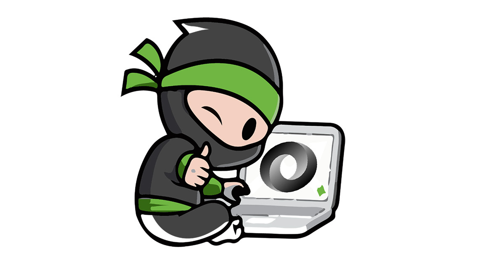

<h1 align="center"> Hi there, I'm Ali Hemmati 👋 </h1>

 
I am a Senior .NET Full-Stack Developer with a passion for building software that makes a difference. With over 10 years in the tech industry, I've had the privilege of working on national-level projects and leading teams to create impactful software solutions. My journey in technology is driven by my curiosity and my commitment to continuous learning and improvement.

<h2 align="center"> 🌟 About Me:</h2>

 
- 🚀 Contributing to large-scale software projects and innovative solutions.  
- 🌱 Passionate about teaching and mentoring juniors and sharing knowledge.  
- 🎯 Focused on creating user-centric and efficient applications.  
- 🌍 Based in Tehran, Iran.

<h2 align="center"> 🔗 Connect with Me:</h2>

 
 
 
 
 

