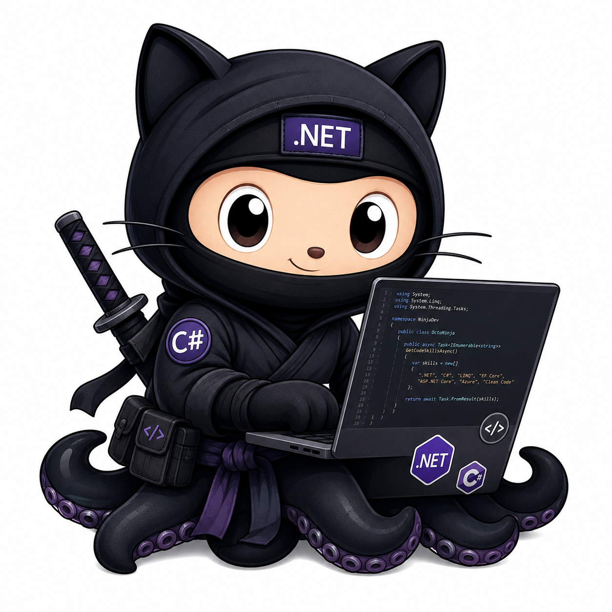

<h1 align="center">Hi, I'm Ali Hemmati 👋</h1>

  <strong>Senior .NET Full-Stack Developer</strong> 
  Focused on building clean, scalable, and high-impact software solutions.

---

With over 12 years of experience in software development, I specialize in full-stack .NET applications and have contributed to national-scale projects. I'm passionate about clean architecture, code quality, and mentoring the next generation of developers. I value continuous improvement and creating software that solves real problems.

---

<h2 align="center">About Me</h2>

• Experienced in designing and delivering large-scale solutions using modern .NET technologies 
• Active mentor and educator for junior developers and teams 
• Strong focus on software architecture, scalable system design, and engineering best practices 
• Based in Tehran, Iran

---

<h2 align="center">Connect with Me</h2>

 
  
  
  
  

