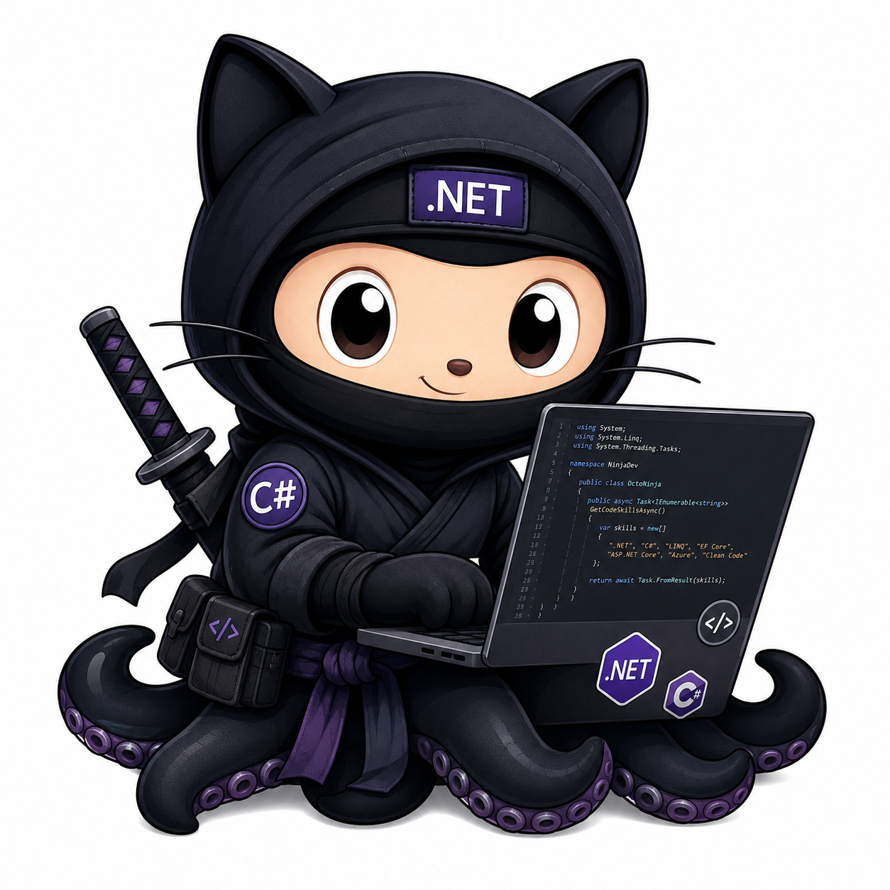

<h1 align="center">Hi, I'm Ali Hemmati 👋</h1>

  <strong>.NET Professional (Full-Stack) | Backend Architecture | Distributed Systems</strong> 
  Building scalable, reliable software with a strong focus on clean design and production quality.

---

With 12+ years of experience, I design and build production systems across travel-tech, fintech, and on-demand logistics.
My work focuses on backend architecture, high-load APIs, data-intensive services, and observability—turning complex requirements into clean, maintainable solutions.
I also enjoy mentoring and helping engineers grow through practical, real-world engineering habits.

---

<h2 align="center">About Me</h2>

• Backend architecture & system design for scalable services 
• High-load APIs, data processing, and performance/reliability improvements 
• Event-driven workflows, messaging, and distributed caching patterns 
• Mentorship, code reviews, and engineering best practices 
• Location: Tehran, Iran (Open to UAE/Oman & Remote roles) 

---

<h2 align="center">Connect with Me</h2>

 
  
  
  
  

